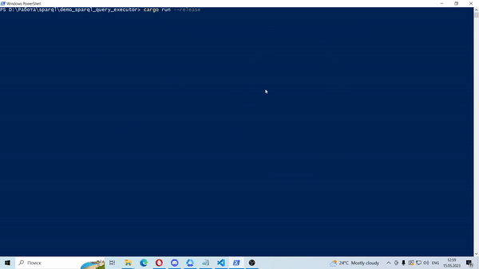

# Sparql query executor

## Abstract
In this project, I developed a SPARQL query executor that uses WikiData to find needed information in Rust. It takes a SPARQL query and returns its result in a table view. This program also stores SPARQL query result in CSV file.

I used a `MediaWiki` crate to connect with Wikibase API and execute a query. I also used a `prettytable` crate to create a table to display the query result and a CSV file, where the query result is stored.

With it you can run any SPARQL query, and the result of the query will be in two formats: CSV file and a table in the terminal, which is very convenient. 

## How to run

1. Install [Rust](https://rustup.rs/)
2. Run the app
```bash
cargo run --release
```

## Example

Here is an example of the program run. The example program finds information about countries' area, population and number of big cities:


