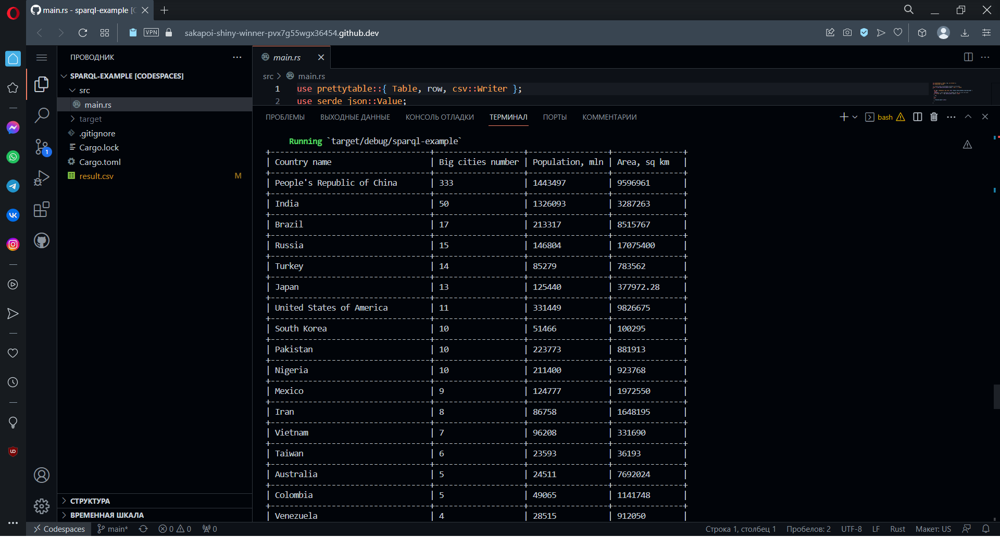

# Sparql query executor

## Description
In this project, I developed a SPARQL query executor that uses WikiData to find needed information in Rust. It takes a SPARQL query and returns its result in a table view. This program also stores SPARQL query result in CSV file.

## Crates used

I used a `mediawiki` crate for connecting with Wikibase API and for executing a query. 
I also used `prettytable` crate for creating a table to display the query result and for creating a CSV file, where the quewy result is stored.

## Try it out!

1. Install [Rust](https://rustup.rs/)
2. Run the app
```bash
cargo run --release
```

## Example

Here is an example of a query, that finds information about countries' area, population and number of big cities:


