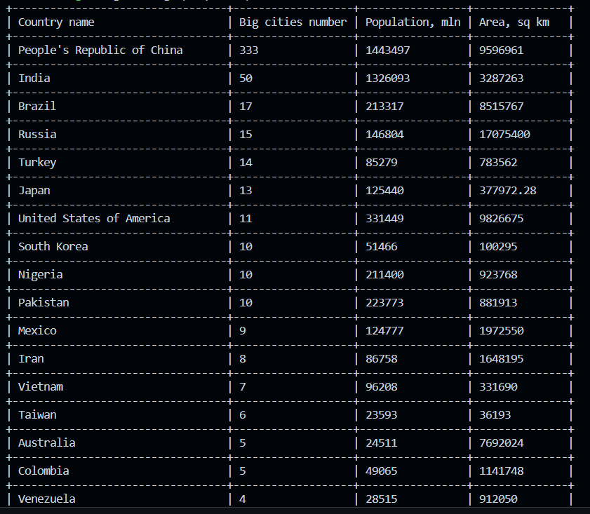

# Sparql query executor

In this project I developed a SPARQL query executor, that use WikiData to find needed information, in Rust. It takes a sparql query and return its result in a table view.

For executing a query I used a `mediawiki` crate. And for creating a table I used crate `prettytable`.

This program also stores SPARQL query result in CSV file.

Here is an example of a query, that finds information about countries' area, population and number of big cities:

